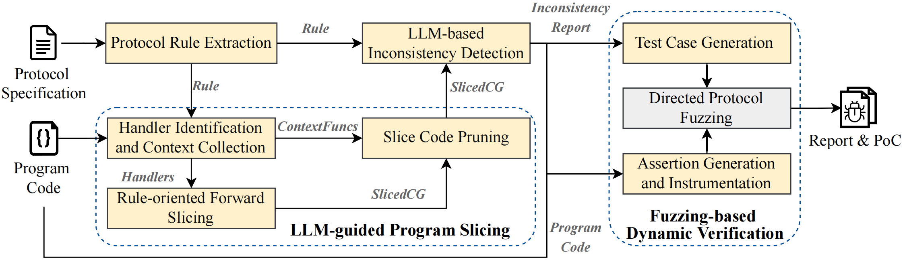

# ProtocolGuard

## Overview of ProtocolGuard


## Setup

* Ubuntu 22.04.3 LTS
* Python 10
* go version go1.18.1
* LLVM 12 & 14, where 12 used for AFLNet compilation, and 14 used for LLVM Analysis
* Cursor

```bash
sudo apt-get install libcurl4-openssl-dev tshark  libsqlite3-dev libclang-14-dev

pip3.10 install transformers openai toml tqm

# Third-party library dependencies (refer to the README for build instructions)
git clone https://github.com/nlohmann/json.git  
git clone https://github.com/SRI-CSL/gllvm.git
git clone https://github.com/SVF-tools/SVF.git
```


## Static Analysis
Extract rules from the specified protocol documentation, perform program slicing, and detect inconsistencies.


### Protocol Rule Extraction

For instructions on extracting protocol rules, please refer to the [rule_extraction/README.md](rule_extraction/README.md) file.

### LLM-guided Program Slicing

**Step1. Preprocess protocol programs, including generating message-related function call graphs, SVF analysis results, etc.**

```bash
# compile target protocol programs: add the compiled option "-g -Xclang -disable-O0-optnone -fno-discard-value-names"
cd /path/project/ && make CC=gclang CFLAGS="-g -Xclang -disable-O0-optnone -fno-discard-value-names" > build_log.txt
get-bc /path/project/protocol_program_binary

# indirect call analysis
/path/SVF-SVF-2.9/build/bin/wpa -print-fp -ander /path/project/protocol_program_binary.bc > fp.txt
python3 /root/llvm-pass-project/indirect_callgraph.py ./fp.txt ./ffp.txt

# pre-static analysis
opt -load-pass-plugin program_slicing/build/src/libAnalyzerPass.so --passes='mem2reg,loop-mssa(licm)' /path/project/protocol_program_binary.bc -o /path/project/protocol_program_binary_ssa.bc

# ast analysis
# (1) extract ast-related files `extracted_commands.sh`
python3 helper_scripts/build_ast_command.py /path/project/build_log.txt /path/project/extracted_commands.txt [project_name] program_slicing/build/src/libASTPass.so 
# (2) execute the script to construct all control flow structure information
cd /path/project/ && ./extracted_commands.sh    
```

**Step2. Fill in the configuration file `config/config.toml`. We have marked the information that needs to be filled in with `#TODO`.**

**Step3. Perform llm-based program slicing.**
```bash
cd /path/project/
opt -load-pass-plugin program_slicing/build/src/libMatchPass.so --passes="match-pass<config=config/config.toml>" < ./protocol_program_binary_ssa.bc
```

### LLM-based Inconsistentcy Detection
```bash
# set LLM Model API
export OPENAI_API_KEY=xxx
# execute the python script (also set configuration in the script)
python3 inconsistency_detection/violation_check.py
```

## Fuzzing-based Dynamic Verification
Complete assertions, generate test cases, and perform directed protocol fuzzing.

### Assert Generation

Run the following command to automatically generate an assertion prompt task file for each inconsistency result. The generated files will be saved in the project directory.
```bash
cd dynamic_verification/assert_generate
python3 gen_assert_prompt.py --db_path [database path] --output_dir [target project directory path] --compile_command "[The compilation command of the project, used by the agent to check the generated code]"
```

Then, we will receive an LLM agent prompt like this. Simply copy it into Cursor Chat to start the process.
```
You are an autonomous AI developer using a two-file system. Your sole sources of truth are @project_config.md (LTM) and @workflow_state.md (STM/Rules/Log), which are located in `./cursorkleosr/`. Before every action, read `workflow_state.md`, consult `## Rules` based on `## State`, act via Cursor, then immediately update `workflow_state.md`.  
MUST complete all the following tasks in `./cursorkleosr/task/` before ending the session:
  - taskxxx.txt
Processing MUST be done one-by-one (no batch processing allowed, as it is unfeasible), fully automated, and require no manual confirmation.
```

### Test Case Generation
```bash
# step1: Generate natural language counterexamples for inconsistent results
python3 dynamic_verification/packet_generate/gen_packet_tasks.py [output directory name] [scapy path] [database path]

# step2: Generate configuration files required for the LLM agent
python3 dynamic_verification/packet_generate/gen_scapy_scripts.py [output directory name] [scapy path]

# step3: Generate raw message bytes for fuzzing
python3 dynamic_verification/packet_generate/payload_extractor_batch.py \
    --input-dir [pcap file path] \
    --output-dir [raw files output path] \
    --server-port [server port] \
    --direction [to-client | to-server] \
    --script-path dynamic_verification/packet_generate.py
```

### Directed Protocol Fuzzing

```bash
# step1: Collect the assertion location for directed fuzzing (`/tmp/reals.txt`)
export ASSERT_OUTPUT_DIR=/tmp && opt -load-pass-plugin program_slicing/build/src/libAssertPass.so --passes="assert-call-analysis" < [llvm bitcode path]

# step2: Fuzzing Compile Configuration (c.f., SelectFuzz & AFLNet)
# `/tmp/reals.txt` is our directed fuzzing targets
export AFLGO=/path/aflnet/
mkdir -p obj-aflgo/temp
export SUBJECT=$PWD
export TMP_DIR=$PWD/obj-aflgo/temp
mv /tmp/real.txt $TMP_DIR/real.txt

# Selective instrumentation
make CC=$AFLGO/afl-clang-fast 
opt-10 -load /path/libDFUZZPASS.so -DFUZZPASS --targets $TMP_DIR/real.txt --outdir $TMP_DIR ./build/[project_binary_name].0.0.preopt.bc

make CC=$AFLGO/afl-clang-fast CFLAGSTEMP="$CFLAGSTEMP -distance=$TMP_DIR/distance.cfg.txt -DASSERT_ENABLED=1"

# step3: Start Fuzzing (AFLNet)
export AFL_SKIP_CRASHES=0
timeout 86400 /root/projects/directed_fuzzing/aflnet/afl-fuzz -d -i [seed path] -o [output path] -m none -P [protocol name] -N [tcp|udp|tcp6|udp6://ip/port]  -D 10000 -q 3 -s 3 -K -z exp -c 30m -- [binary name]
```


## Example
A detailed record of example usage commands is provided in `example/README.md` for reference.